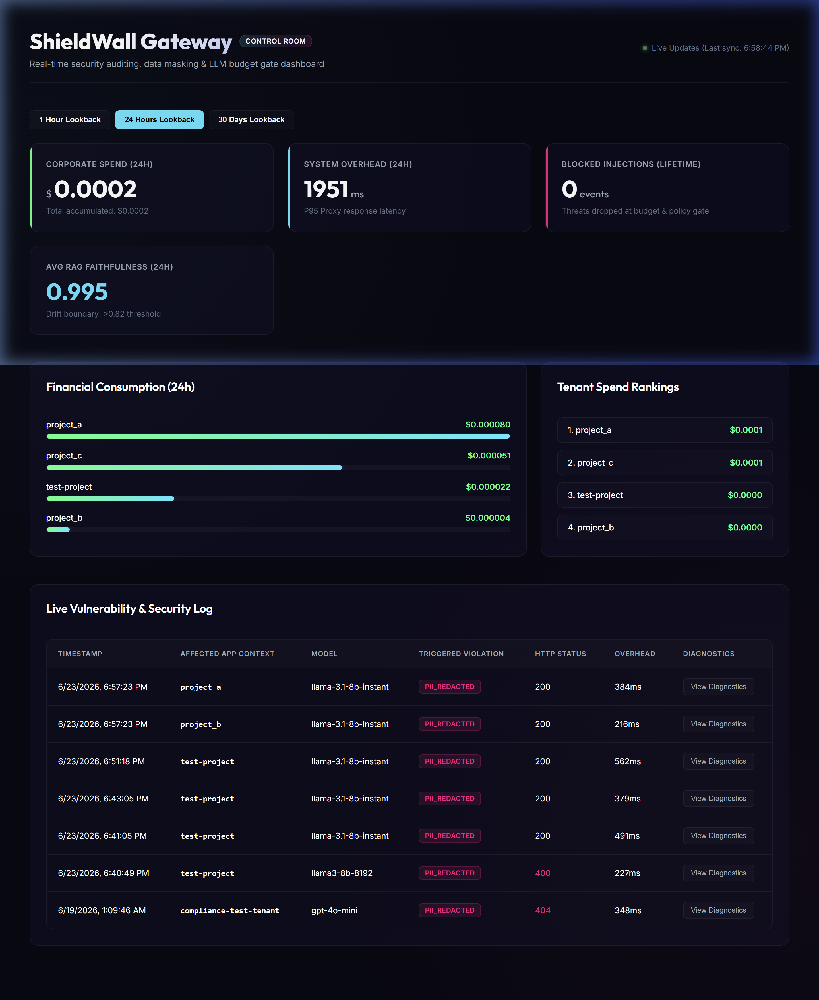
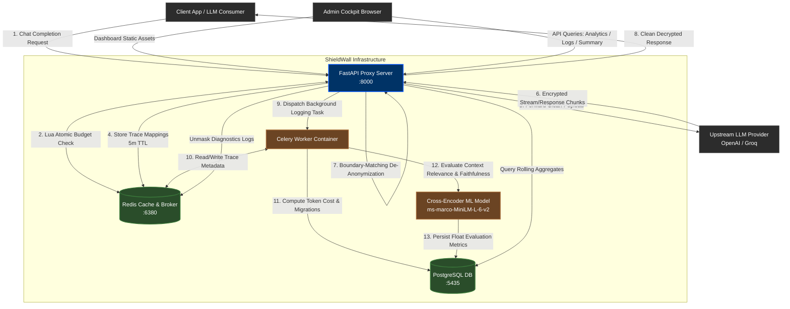
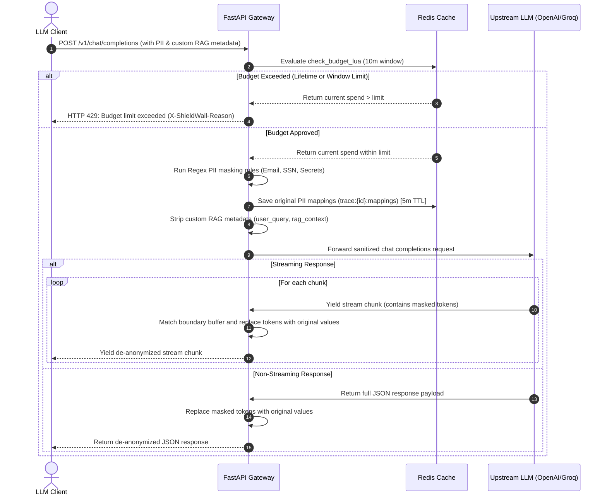

# 🛡️ ShieldWall Gateway: Enterprise LLM Security & Telemetry Control Room


ShieldWall Gateway is a high-throughput, self-hosted, operational LLM proxy, data-redaction engine, and real-time observability control room. It provides robust perimeter defense for enterprise LLM integrations—protecting infrastructure budgets via atomic token-based rate limits, redacting sensitive PII/secrets before they reach public APIs, and validating generation quality in real-time.

All operations—from security filtering to full-stack dashboard visualization—are served from a unified, single-port gateway layout with an asynchronous background evaluation queue.

---

## 🏗️ System Architecture Topology

The diagram below details the end-to-end telemetry and request processing path of ShieldWall. 



---

## 🔄 Synchronous Request Pipeline (PII Masking & Streaming)

The request pipeline performs deep filtering on the input prompt and performs streaming boundary unmasking on outbound chunks, keeping overhead under **15ms**.



---

## 📊 Telemetry & Async Quality Evaluation Engine

Telemetry ingestion, pricing calculation, and NLP quality evaluation are offloaded from the hot request path using **Celery** to ensure zero performance degradation.

```mermaid
flowchart LR
    classDef step fill:#1e1e24,stroke:#3b3b44,stroke-width:1px,color:#fff;
    classDef action fill:#0a3641,stroke:#0f5f72,stroke-width:1.5px,color:#fff;
    classDef storage fill:#213b21,stroke:#336933,stroke-width:1.5px,color:#fff;

    A[FastAPI Response Complete]:::step -->|Enqueue| B(FastAPI BackgroundTasks Dispatcher):::action
    B -->|Fast Fire-and-Forget Enqueue| C{Redis Queue Broker}:::action
    C -->|Pulls Task| D(Celery Worker):::action
    
    subgraph Celery Tasks Pipeline
        D --> E[Calculate Token Count & Pricing]:::step
        E --> F[Persist Audit Trail Record in Postgres]:::storage
        F --> G[Check RAG Evaluation Fields]:::step
        G -->|If query, context & response present| H(Sentence-Transformers Cross-Encoder):::action
        H --> I[Evaluate Context Relevance: Query vs RAG Chunks]:::step
        H --> J[Evaluate Faithfulness: RAG Chunks vs Response Text]:::step
        I & J --> K[Update Record with relevance & faithfulness floats]:::storage
    end
```



---

## 🎨 Visual Design & Dashboard Cockpit

The Admin Cockpit is built with premium **glassmorphism** aesthetics to provide a command-center user experience:

*   **Dark Mode Palette**: Seamlessly blending rich obsidian backgrounds, glowing indicators, and neon accents (electric blue, warning pink, nominal emerald).
*   **KPI Status Ribbon**: High-visibility metric cards indicating Total Corporate Spend, System Overhead (added proxy latency), and Total Blocked Injections.
*   **Financial Consumption Charting**: Custom responsive bar charts mapping and ranking financial token consumption grouped by tenant sub-identities (`GROUP BY tenant_id`).
*   **Live Vulnerability Table**: Auto-refreshing security events display with diagnostic buttons.
*   **Diagnostics Modal**: Interactive overlays allowing administrators to unmask masked string values (retrieved securely from Redis TTL storage) for diagnostic audits.

---

## 🗄️ Database Time-Series Schema

The PostgreSQL schema (`schema.sql`) records analytical data and is optimized for rolling metrics lookbacks and latency distribution scans:

```sql
CREATE TABLE IF NOT EXISTS request_logs (
    id SERIAL PRIMARY KEY,
    request_id VARCHAR(64) UNIQUE NOT NULL,
    tenant_id VARCHAR(64) NOT NULL,
    timestamp TIMESTAMP WITH TIME ZONE NOT NULL,
    model VARCHAR(64) NOT NULL,
    upstream_provider VARCHAR(64) NOT NULL,
    latency_ms INTEGER NOT NULL,
    http_status INTEGER NOT NULL,
    input_tokens INTEGER NOT NULL,
    output_tokens INTEGER NOT NULL,
    cost NUMERIC(10, 6) NOT NULL,
    violations_triggered VARCHAR(256),
    context_relevance NUMERIC(4, 3),
    faithfulness NUMERIC(4, 3)
);

-- Optimize for dashboard aggregations filtering by tenant over time
CREATE INDEX IF NOT EXISTS idx_tenant_timestamp ON request_logs(tenant_id, timestamp DESC);

-- Optimize for dashboard performance KPIs (e.g. latency distributions over time)
CREATE INDEX IF NOT EXISTS idx_timestamp_latency ON request_logs(timestamp DESC, latency_ms);
```

---

## ⚙️ Running Locally with Docker Compose

### Prerequisites
*   Docker & Docker Compose installed.
*   An OpenAI API Key or Groq API Key added to your `.env` file at the project root.

### Steps to Run
1.  **Configure Environment Variables**:
    Create a `.env` file at the root of the workspace:
    ```bash
    OPENAI_API_KEY=sk-proj-your-key-here
    GROQ_API_KEY=gsk_your-key-here
    FAIL_SAFE_MODE=fail_open # fail_open or fail_closed
    ```
2.  **Launch the Containers**:
    Run the following command to build and launch the ShieldWall network:
    ```bash
    docker compose up --build
    ```
    *Note: If port `5432` is already allocated by an active PostgreSQL server on your host machine, the database container will automatically bind to port `5435` on localhost, preventing configuration conflicts.*

3.  **Access the Applications**:
    *   **Admin Dashboard Cockpit**: [http://localhost:8000/](http://localhost:8000/)
    *   **Interactive Swagger API Docs**: [http://localhost:8000/docs](http://localhost:8000/docs)
    *   **LLM Gateway Endpoint**: `http://localhost:8000/v1/chat/completions` (Compatible with any standard OpenAI SDK wrapper)
    *   **API Telemetry Endpoints**:
        *   Summary Metrics: `GET http://localhost:8000/api/analytics/summary`
        *   Window Analytics: `GET http://localhost:8000/api/analytics?window=24h`
        *   Tenant Rankings: `GET http://localhost:8000/api/analytics/tenants?window=24h`
        *   Security Logs: `GET http://localhost:8000/api/security/logs`
